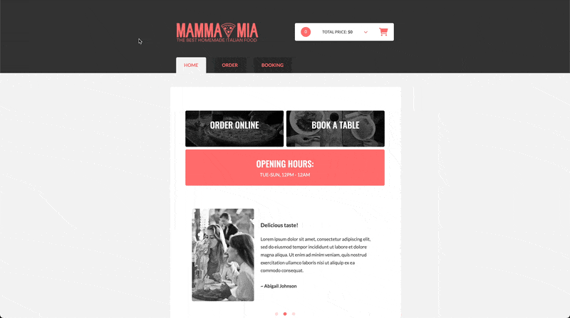
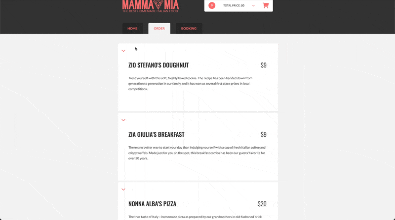
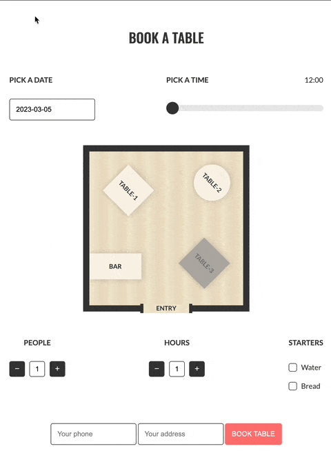

<a id="readme-top"></a>

<p align="center">
  <br>
 </a>
</p>

<h4 align="center">Pizzeria website created as part of the Kodilla Bootcamp project. <br /> Website was developed using JSON server, JavaScript classes Handlebars templates,<br /> Flatpickr as a datetime picker, Range-Slider and Flickity for carousels .</h4>

<p align="center">
  <a href="#demo">Demo</a> •
  <a href="#overview">Quick overview</a> •
  <a href="#languages">Languages&Tools</a> •
  <a href="#roadmap">Roadmap</a> •
  <a href="#how-to-use">How To Use</a> •
  <a href="#contact">Contact</a>
</p>

<br />

<p align="center">
  
<p>

## 💻 <a id="demo">Demo :</a>

If you want check jsPizzeria, it is deployed on Replit. Just click link below :
<br />

https://js-pizzeria.imdpd.repl.co/

<p align="right">(<a href="#readme-top">back to top</a>)</p>

## 🚀 <a id="overview">Quick overview :</a>

The Pizzeria website was developed using JavaScript classes and a Handlebars templates. A website created in the SPA model is fully loaded only once, and then when navigating the pages, elements are replaced by those that are characteristic of a specific page. JSON Server is used as a database for orders, products, events, bookings.

The first page contains:

1. Links to orders and booking subpages.
   Moving to the next subpages changes the URL address.
2. Carousel with customer reviews.
   I used Flickity to create it
3. Flex box with a gallery of sample photos.

The order page contains dishes that the pizza restaurant has on its menu. Individual products have been fetched from JSON server. The customer has the ability to configure each of the products using radio buttons and checkboxes. Along with the selection of individual ingredients, the price of the product is updated. Pizza and the salad have a appearance change feature. Product quantity can be selected from 1 to 10. The Add to Cart button adds a personalized product to your cart.

<p align="center">
  
<p>

<p align="right">(<a  href="#readme-top">back to top</a>)</p>

On the third page, you can book a table in a restaurant. Flatpick was used to select the booking date. The Range-slider allows us to choose the booking time from the opening hours of the restaurant. The customer has the option to select the number of guests and the estimated booking time in the range from 1 to 10. The customer also has the option of specifying the type of starters in advance. Depending on the time and day of booking, available tables are updated. Attempting to select a reserved table results with
information alert. Selecting a free table changes its color to green. After clicking the booking button saves the booking data to the JSON server

<p align="center">
  
<p>

<p align="right">(<a href="#readme-top">back to top</a>)</p>

## 🛠️ <a id="languages">Languages & tools</a>

|                                                                   Language / Tool                                                                    | Description                                                                 |
| :--------------------------------------------------------------------------------------------------------------------------------------------------: | :-------------------------------------------------------------------------- |
|                                         | Language used for structuring and presenting content on the World Wide Web. |
|                                          | CSS pre-procesor that make writing CSS more powerful.                       |
|  | To create dynamically updating content.                                     |
|                 | Library used to create reusable webpage templates in HTML document.         |
|                                          | Node Module that is used to create demo rest json webservice                |
|                                                                     Range-slider                                                                     | JavaScript for the HTML5 slider element.                                    |
|                                                                      Flatpickr                                                                       | Lightweight datetime picker.                                                |
|                                                                       Flickity                                                                       | Touch, responsive, flickable carousels.                                     |
|                                    | Helps you find and fix problems with your JavaScript code.                  |
|                           | Helps avoid errors and enforce conventions                                  |

<p align="right">(<a  href="#readme-top">back to top</a>)</p>

## 📌 <a id="roadmap">Roadmap :</a>

- [x] Add Home page
- [x] Add Responsiwe Web Design
- [ ] Set cart default state on submit event.
- [ ] Order confirmation on submit event.
- [ ] Set product quantity to 0 on click event on "Add to cart" button.

<p align="right">(<a  href="#readme-top">back to top</a>)</p>

## 💾 <a id="how-to-use">How To Use :</a>

```bash
# Clone this repository
$ git clone https://github.com/iMdPd/jsPizzeria.git

# Go into the repository
$ cd random/directory/jsPizzeria

# Install dependencies
$ npm install

# Run the app
$ npm run watch
```

<p align="right">(<a href="#readme-top">back to top</a>)</p>

## 🤙🏻 <a id="contact">Contact :</a>

> GitHub [@iMdPd](https://github.com/iMdPd)
